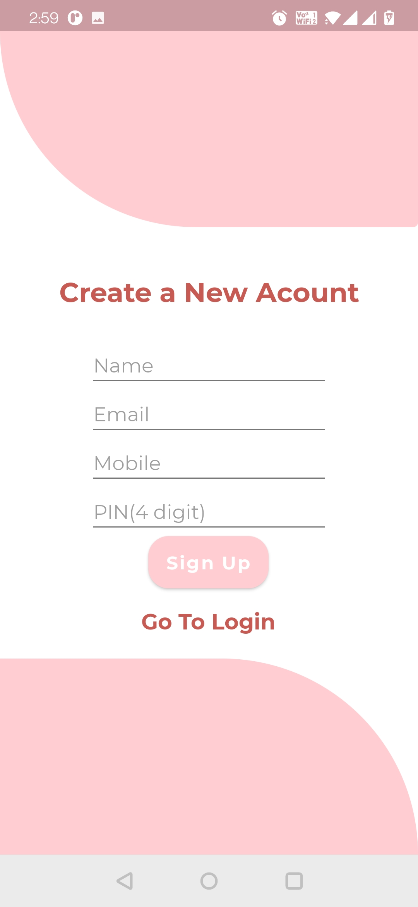
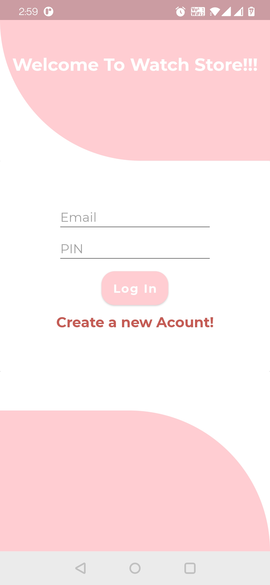
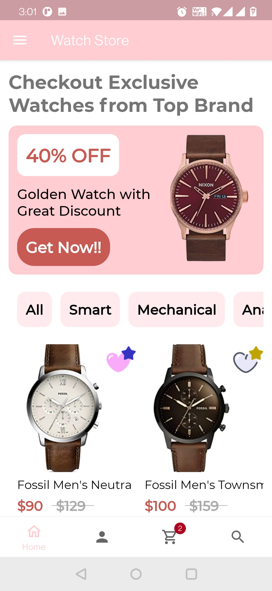
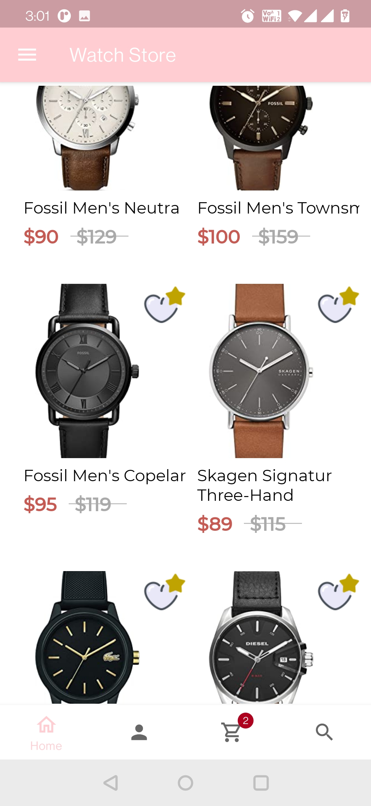
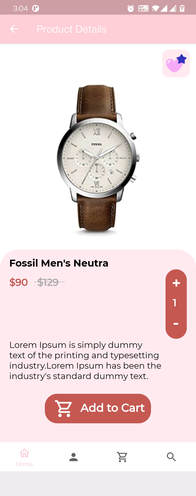
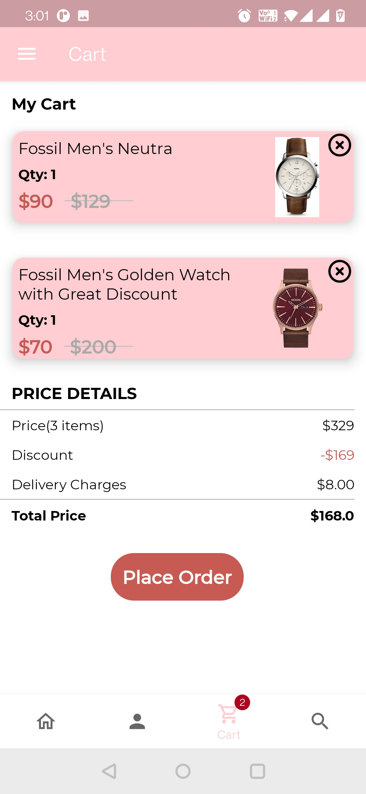
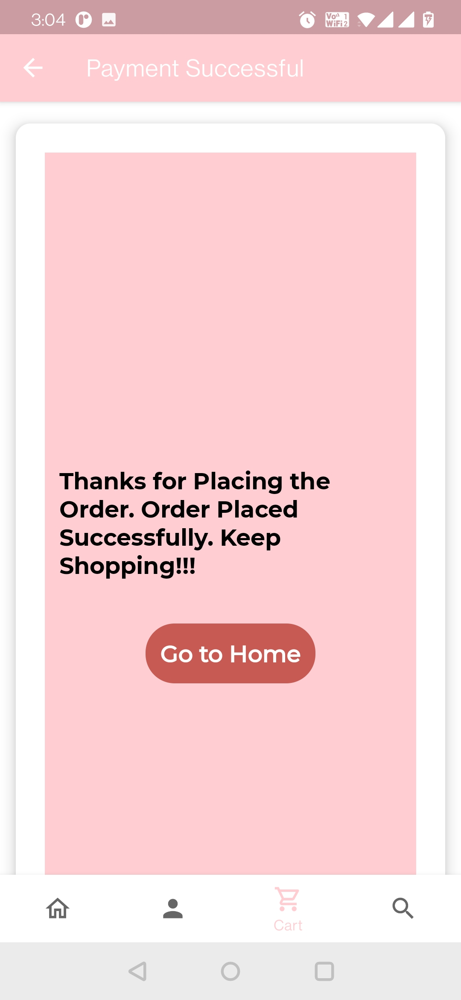
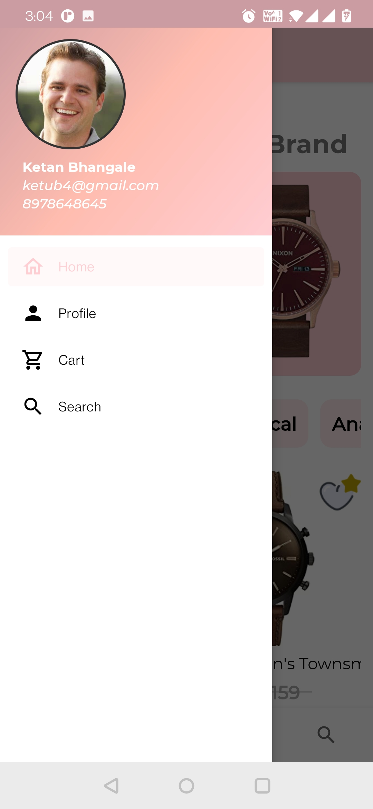

# WatchStore Sanple App Like Ecommerce App

Developed using Kotlin. Features used:
1. Firebase Firestore
2. Navigation Component.
3. MVVM Architecture
4. RecyclerView, Coroutines

Screenshots:

     &nbsp;&nbsp;&nbsp;  
    

     

     &nbsp;&nbsp;&nbsp;  
    

     

     &nbsp;&nbsp;&nbsp;  
    

     

     &nbsp;&nbsp;&nbsp;  
    

     

     &nbsp;&nbsp;&nbsp;  
    

     

